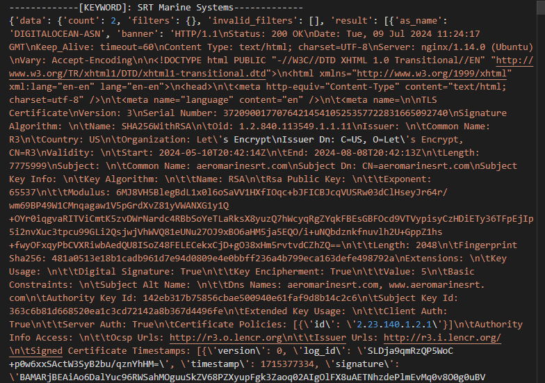

# Description

This is a program that helps you find ship related assets using the criminal ip Asset Search API.

# Prerequisites

* [criminalip.io](https://www.criminalip.io) API Key

Create an account and get an API key at https://www.criminalip.io.

You can still get an API key in a free account. THE API KEY IS VITAL IN THIS PROGRAM.

# Installation

Enter the received API key value into the CRIMINALIP_API_KEY variable in the criminalip_ship.py file.

If there is a criminal IP search query you want to add, add it to the QUERY_LIST list.

# Getting started

execute criminal_ship.py file

# Screens

# Optional Arguments

If tag:Ships is not enough, you can add your own query.

It is best to search by the name of the communication device company used on the ship, etc.
